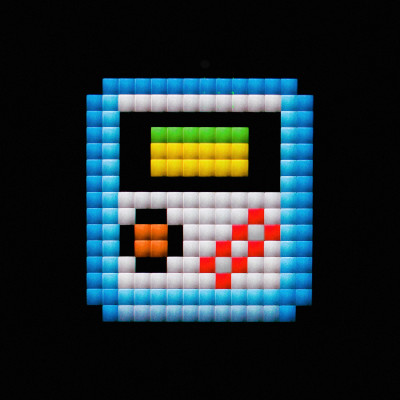
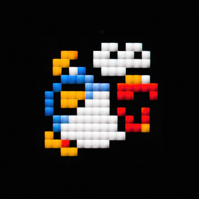
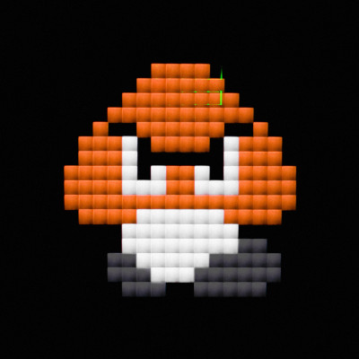
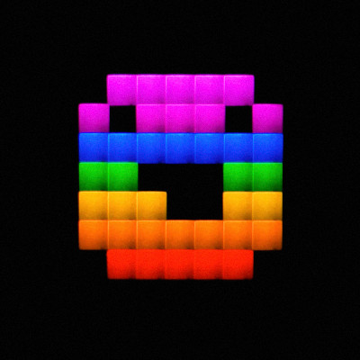
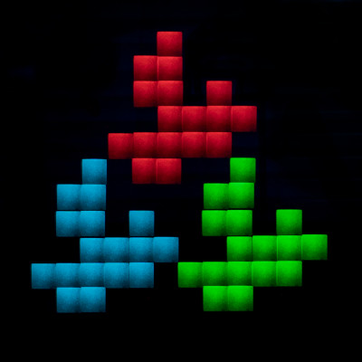
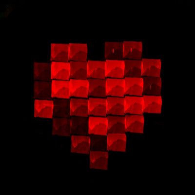

# Light Printer

## Table of contents
- [What is it?](#what-is-it)
- [Gallery](#gallery)
- [How to run it?](#how-to-run-it)
    - [Requirements](#requirements)
    - [First run](#first-run)
    - [Input images](#input-images)
    - [Constants](#constants)
    - [Camera settings](#camera-settings)

## What is it?
**Light Printer** is a small project developed with love for long exposure photos. The program originally works on Raspberry Pi which sends G-code commands directly to the Anet A8 3D-printer. The printer doesn't print anything but it is used as some kind of vertical plotter. There is a RGB LED on the front part of the printer's extruder which is also controlled by Raspberry. Everything closely works together so we can take a long exposure photo of whole process to get a final image.

Here you can see this project in action:

## Gallery

    
    
    
    
    
    

## How to run it?
Please note that this code is written only for **Anet A8 3D printer**. I haven't tested it for any other printers so it would have to be adjusted a little bit.

### Requirements
- **Anet A8 printer** - but actually it could be anything which is G-code programmable, has X and Y axis and allows you to put a LED box on its head.
- **Raspberry Pi** - or something with GPIO ports and Python.
- **A camera with (very) long exposure photos** - 30s exposure may be too short period of time. Average photo needs a few minutes to be drawn completely.
- **A box with a small hole and RGB LED inside** - we have to be sure that every shot of a single photo's pixel will se sharp. There is no place for freely flashing LEDs. I have prepared some 3D-printable models to store LED which are ready to be used with Anet A8:

### First run
1. Install Python requirements from `requirements.txt`on your Raspberry Pi.
2. Connect the printer to your Raspberry Pi using USB.
3. Run `sudo pigpiod` to initialize GPIO ports (if you reboot RPi you will need repeat this step again).
4. Run `lightprinter.py`.
5. There should be a list of available serial ports. If you see your printer's one, type its name.
6. Follow the instructions to "draw" an image.

### Input images
Input images should be located inside the `input` directory. They mustn't contain transparent pixels. To speed up printing, empty pixels should be black `#000000` - they will be skipped.

### Constants
If you have a look inside `lightprinter.py` there are some constants which are suitable for my setup:

- `LIGHT_TIME` - The time of a single pixel lighting **[sec]**
- `Z_SLEEP_PER_MM` - The constant used to calculate the time from sending vertical move command to turning on the LED* **[sec/mm]**
- `X_SLEEP_PER_MM` - The constant used to calculate the time from sending horizontal move command to turning on the LED* **[sec/mm]**
- `Z_STEP` - Vertical step size **[cm]**
- `X_STEP` - Horizontal step size **[cm]**

- `PIN_RED` - GPIO pin number for red light control.
- `PIN_GREEN` - GPIO pin number for green light control.
- `PIN_BLUE` - GPIO pin number for blue light control.

**&ast;** If the program send move command to the printer, the extruder won't be moved instantly. So that we need to wait a bit untill the extruder is in the right place. The final delay time equals to `X_STEP * X_SLEEP_PER_MM` for horizontal movement and `Z_STEP * Z_SLEEP_PER_MM` for vertical.

### Camera settings
Long exposure time depends on the an image size. Every input image row adds additional seconds so it usually takes a few minutes to make a picture. The most importat thing is there must be a **fully dark room** because every single light may be visible on the final picture.

To create the pictures from the [gallery](#gallery) section I used F3.2 and F3.5 shutter, ISO 100 and manual exposure time.
